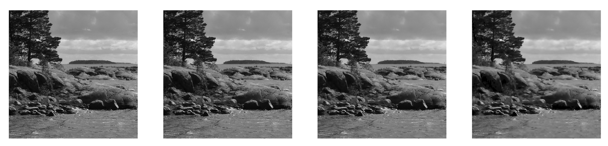
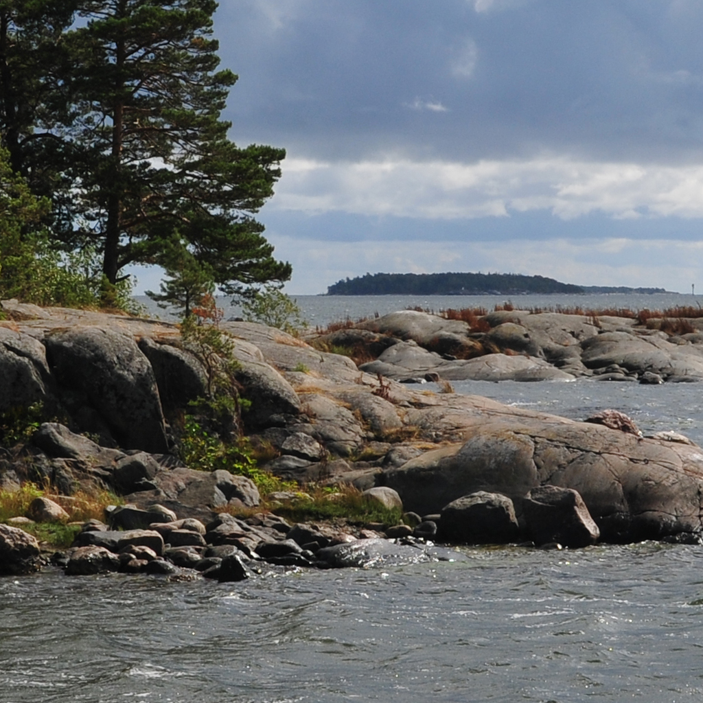
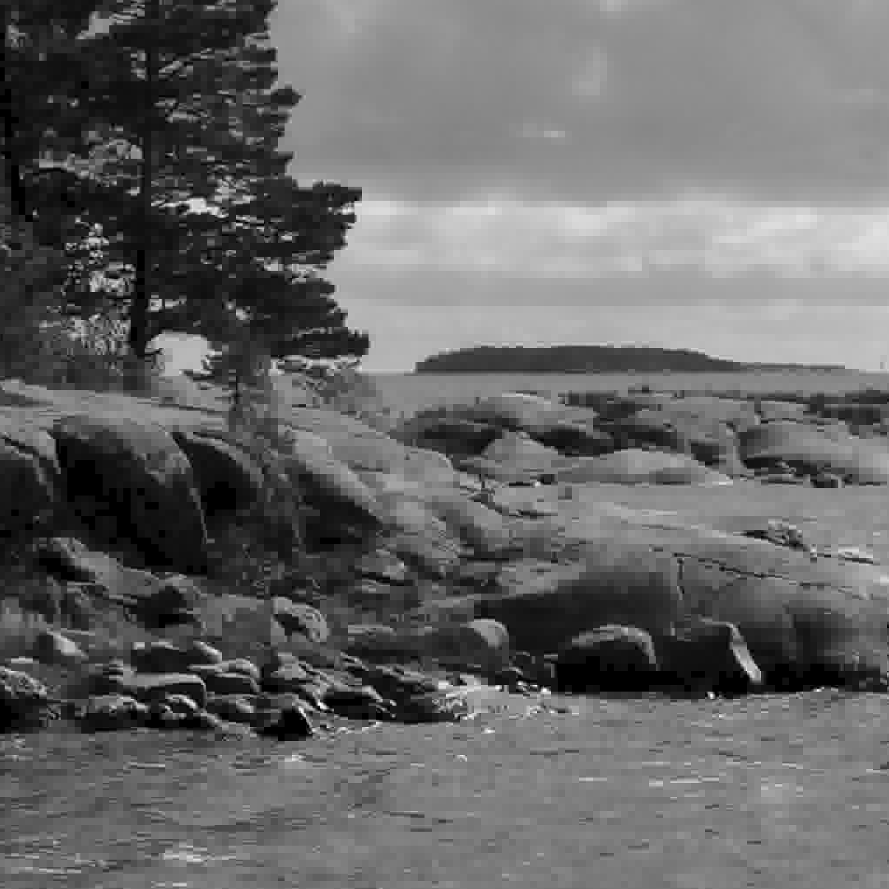
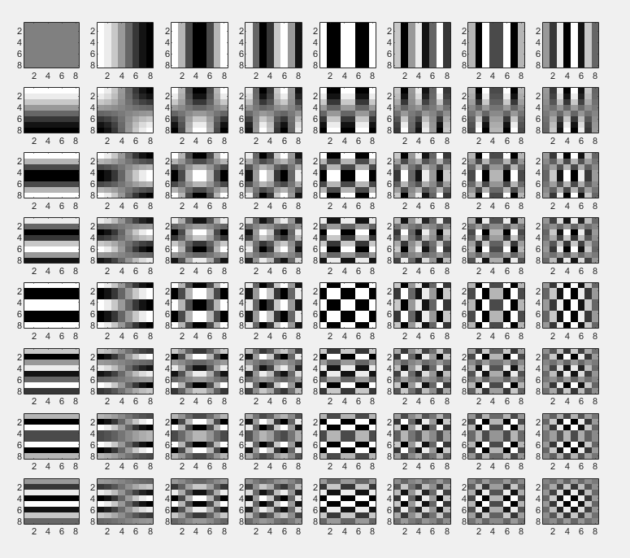

# JPEG-compression

A Matlab implementation of the JPEG image compression format (e.g. .jpg files). Note that this project only implements the compression part and doesn't implement any kind of entropy encoding at all (such as Huffman). Also, note that the code does compression only for grayscale images.

The code produces following results:

From left to right the compression rates are: 0, 0.90, 0.95, 0.98, meaning the rightmost image is only 2% of the size of the original image. Since the images are so small it's difficult to see the artifacts from the compression, here are full-res ones for the original and the 0.98 compressed one:

From here the 8x8 blocks which JPEG images are divided into are visible. The base blocks that are used for the DCT-II transform are also easy to visualize:

When right coefficients